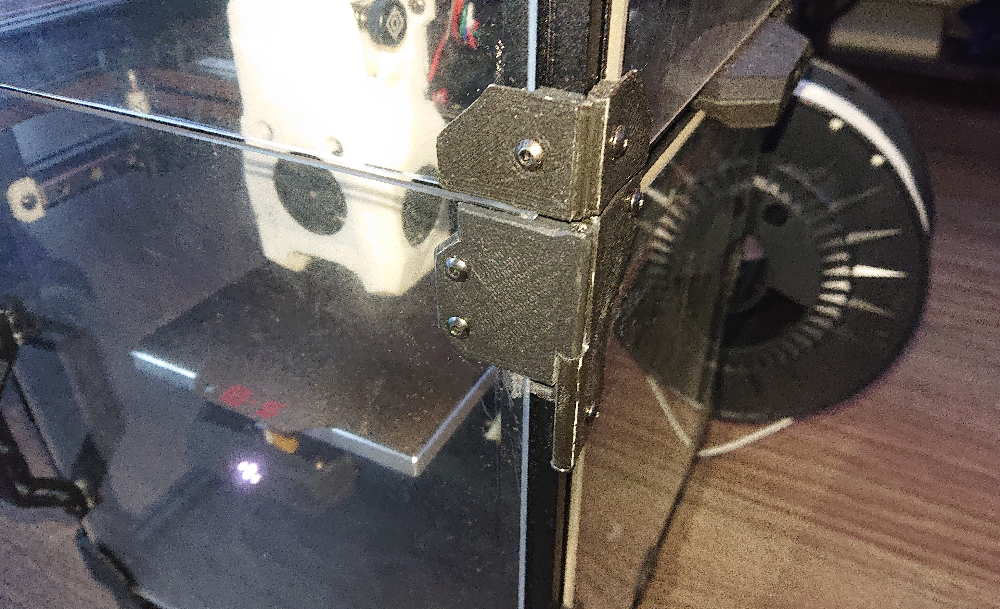
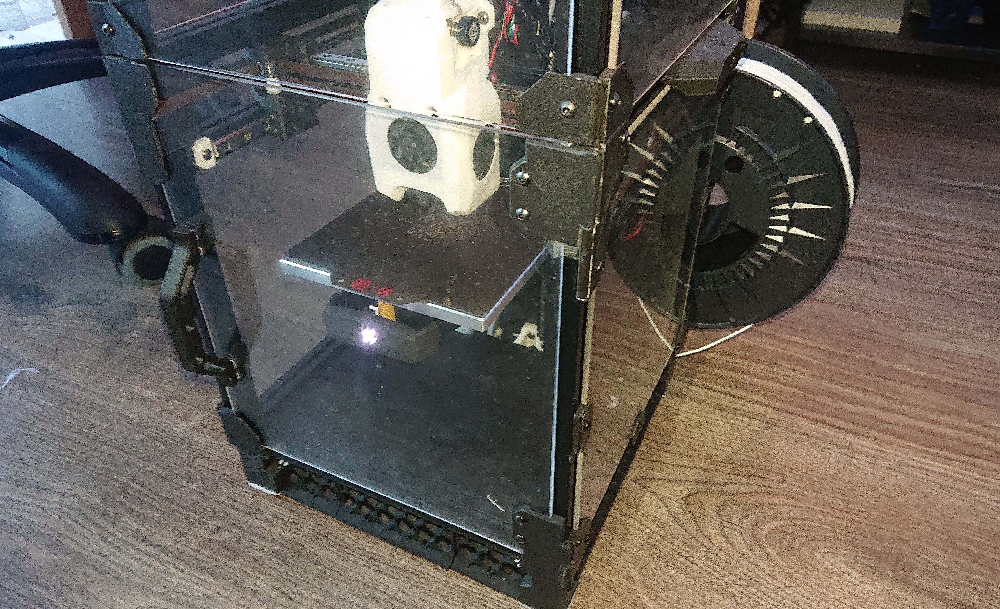

# screw-hinges

This is a voron 2.4 mod.
Screws are used to connect the acrylic door panel to the hinges,
instead of adhesive tape.

This mod is a lazier version of [Door Hinges](https://mods.vorondesign.com/details/gIhx44wX7vCGIfeuiERtQ),
as it does re-uses half of the original hinges and
does not require, or allow, the use of tape.

## Photos

